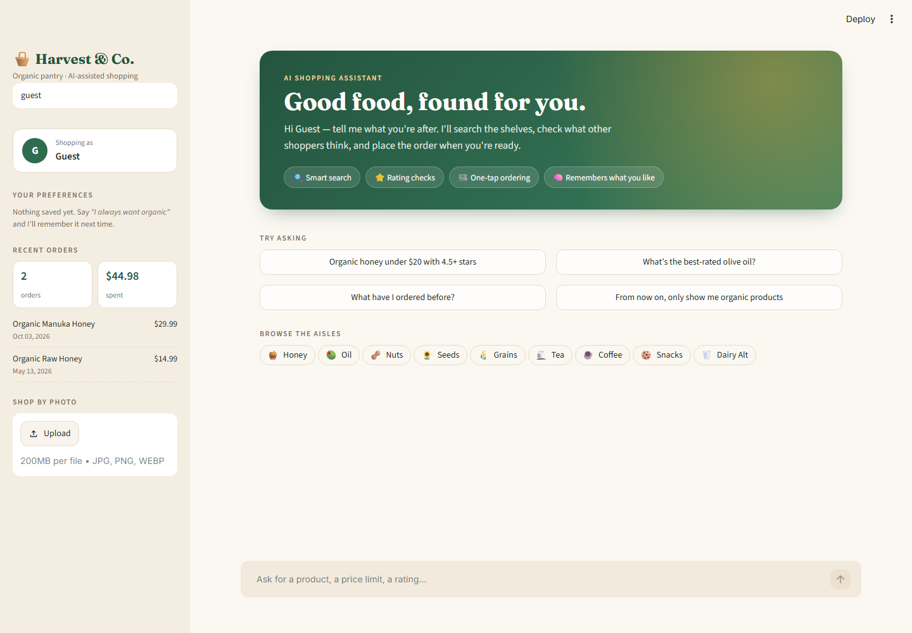
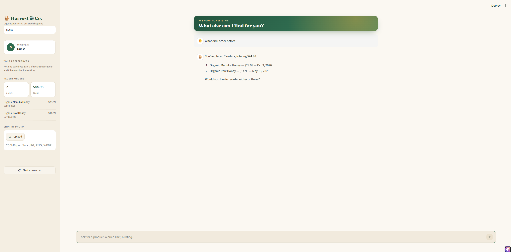

# Agentic AI Projects

Two LLM applications built with LangChain, Groq and Streamlit.

## 1. AI Shopping Agent — `10_proj_Shopping_Agent/`

A tool-calling agent that searches a product catalog, checks ratings, and places orders through natural conversation — and remembers each shopper's orders and preferences across sessions.



*Asking about past orders — the agent queries the order history and offers to reorder:*



- **Tools:** `search_products` (SQLite search with price/organic filters), `get_rating`, `checkout`, `describe_product_image` (shop by photo), `get_order_history`, `get_preferences`, `update_preferences`
- **Agent:** LangChain `create_agent` with a system prompt defining browse → rate → confirm → order flows
- **Memory & personalization:**
  - *Order history* — "what have I ordered before?" is answered from the `orders` table, with totals and one-step reorder
  - *Lasting preferences* — "I always want organic" or "never over $20" is saved per user and applied automatically in future sessions
  - The user ID is passed to tools through LangChain's runtime context, never by the LLM, so the model can't read or change another shopper's data
- **UI:** Streamlit app with product cards and one-click ordering, aisle browsing, a shopper profile with saved preferences and recent orders, and photo search

```bash
cd 10_proj_Shopping_Agent
streamlit run app.py
```

## 2. Telecom Support RAG — `11_Rag_telecom/`

A customer-care chatbot that answers questions using retrieval-augmented generation over three sources: FAQs, past support tickets, and a PDF guide.

- **Retrieval:** Chroma vector store with `all-MiniLM-L6-v2` embeddings; top-3 results from each collection are merged
- **Generation:** Qwen3 on Groq, instructed to answer only from retrieved context
- **UI:** Streamlit chat with streaming responses (or a CLI via `main.py`)

```bash
cd 11_Rag_telecom
python ingest_faq.py
python ingest_tickets.py
python ingest_pdf.py
streamlit run app.py
```

## Setup

Requires Python 3.14 and [uv](https://docs.astral.sh/uv/).

```bash
uv sync
```

Create a `.env` file in the repo root:

```
GROQ_API_KEY=your_key_here
```
